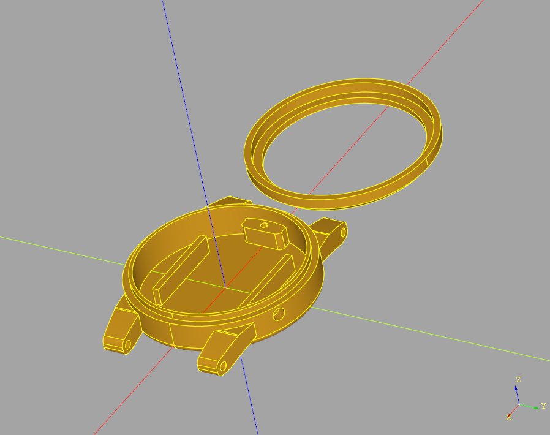

# 3D Model
The plan is created with `CADQuery 2.1` in `CQ-editor 0.3.0.dev0` - insipred by [@DanielLaszlo](https://github.com/DanielLaszlo)


### Install micromamba
Tested with Microbamba 0.9.2
```Bash
cd ~/.local
wget -qO- https://micromamba.snakepit.net/api/micromamba/linux-64/latest | tar -xvj bin/micromamba

./bin/micromamba shell init -s bash
source ~/.bashrc
```
### Create environment
```bash
micromamba create -n cad python=3.9 -c conda-forge
micromamba activate cad

micromamba install -c cadquery -c conda-forge cadquery=master
micromamba install -c cadquery -c conda-forge cq-editor=master
```
